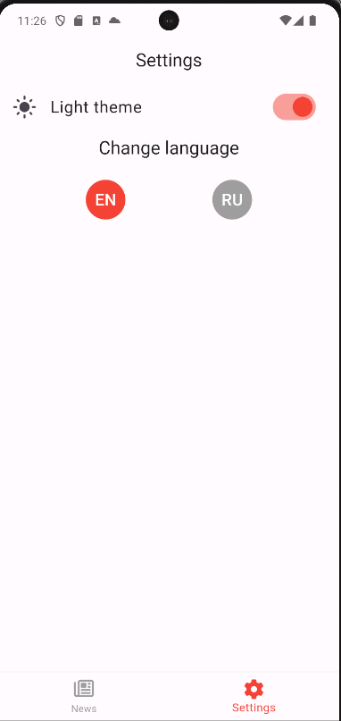

# Новостное приложение

Это мобильное приложение на Flutter, которое отображает новостные статьи, полученные из API. Пользователи могут просматривать последние новости, читать их описания и просматривать полные детали статьи, нажимая на нее.

## Особенности

- **Просмотр новостей**: Пользователи могут просматривать список новостных статей, полученных из API.

- **Чтение подробностей статьи**: Пользователи могут читать полные детали новостной статьи, нажав на нее.

- **Настройки**: Пользователи могут получить доступ к настройкам для конфигурации параметров приложения.
- 

## Используемые технологии

- Flutter: Инструментарий для создания нативных приложений для мобильных устройств, веба и настольных компьютеров из единого исходного кода.
- Dart: Язык программирования, используемый для разработки приложений Flutter.
- Easy Localization: Библиотека для обработки интернационализации (i18n) и локализации (l10n) в приложениях Flutter.
- Font Awesome Flutter: Библиотека, позволяющая легко добавлять иконки Font Awesome в ваше приложение Flutter.
- News API: Простой HTTP REST API для поиска и получения актуальных новостей из разных источников в Интернете.

## Использование

- При запуске приложения вы увидите список новостных статей.
- Нажмите на статью, чтобы прочитать ее описание.
- Нажмите на кнопку, чтобы просмотреть новость на официальном сайте.
- Переместите палец вправо, чтобы перейти на экран настроек.

## Файлы для скачивания

Для скачивания файла нажмите на ссылку ниже:

- [Скачать пример файла](https://github.com/ED1LOAD/Flutter-News-App/blob/main/app-release.apk)

## Вклад в разработку

Ваши вклады приветствуются! Если вы обнаружили ошибки или у вас есть предложения по улучшению, пожалуйста, откройте issue или отправьте pull request.

## Лицензия

Этот проект лицензирован в соответствии с MIT License - см. файл [LICENSE](LICENSE) для получения дополнительной информации.

## Благодарности

Благодарим создателей Flutter и различных плагинов, использованных в этом проекте.

Особая благодарность News API за предоставление новостных статей, используемых в этом приложении.
Отдельное спасибо Аяне!
